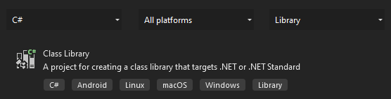
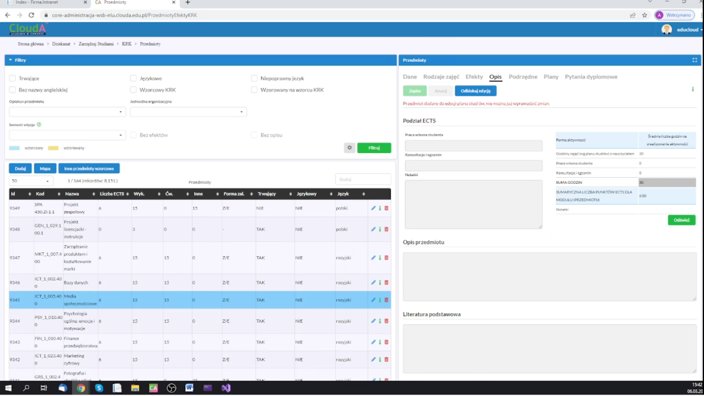
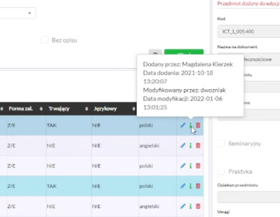
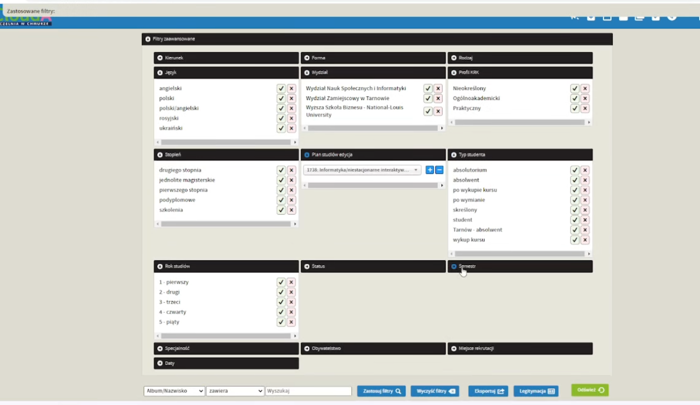

# Programowanie internetowych aplikacji biznesowych

Opis: Semestr 6, mgr Artur Kornatka   
[Projekt na GitHub](https://github.com/kzrepo/s6-aplikacje-internetowe-kurs)

## Założenia

1. Każde zajęcia są w oddzielnym branch'u, po sprawdzeniu są merge'owane z main przed kolejnymi zajęciami
2. Branch'e są opisywane zgodnie z informacjami i punktami na zajeciach
3. Oznaczenia branch'ów
   - `bm1-branch-name` - branch merge'owany z main
   - `bn1-branch-name` - branch nie merge'owany z main, np. przykłady z pierwszego wykładu, lub jakieś testy
4. Przydatne polecenia git
   - `git checkout branch-name` - przełączenie się na wybraną gałąź, git automatycznie zmienia pliki w projekcie
   - `git checkout -` - przełączenie się na poprzednią gałąź, najczęściej wrócimy do main i uaktualnią się pliki w projekcie

## Dokumentacja

#### Git, wersjonowanie i tagowanie

1. [Kurs Git'a [PL]](https://youtube.com/playlist?list=PLj-pbEqbjo6AKsJ8oE2pvIqsb15mxdrxs)
2. [Conventional Commits - Nazewnictwo commitów w Git](https://www.conventionalcommits.org/en/v1.0.0/)
3. [Semantic Versioning - Numerowanie wersji](https://semver.org/)
4. [Tagowanie - Git, Releases - GitHub](https://youtu.be/Wq_zrz7jV80)

#### Frameworki CSS

1. [Strona z dokumentacją ASV.NET Core](https://docs.microsoft.com/en-us/aspnet/core/?view=aspnetcore-6.0)
2. [Material Design - strona projektu](https://material.io/)
   1. [Material Design - Web Develop](https://material.io/develop/web)
   2. [Mateerialize - CSS framework oparty na Material Design](https://materializecss.com/)
3. [Bootstrap](https://getbootstrap.com/)
4. [Material Design for Bootstrap v5 & v4](https://mdbootstrap.com/)
5. [Pure.CSS - lekki framework CSS](https://purecss.io/)
6. Przegląd frameworków
   1. [9 Best CSS Frameworks in 2022](https://athemes.com/collections/best-css-frameworks/)
   2. [20 Best Material Design CSS Frameworks for Websites](https://superdevresources.com/material-design-web-ui-frameworks/)

#### Data Annotations

1. [Part 6: Using Data Annotations for Model Validation](https://docs.microsoft.com/en-us/aspnet/mvc/overview/older-versions/mvc-music-store/mvc-music-store-part-6)
2. [Model Validation Using Data Annotations In ASP.NET MVC](https://www.c-sharpcorner.com/article/model-validation-using-data-annotations-in-asp-net-mvc/)

#### Mircrosoft Dokumentacja

1. [Entity Framework Core](https://docs.microsoft.com/en-us/ef/core/)
2. [Entity Properties](https://docs.microsoft.com/en-us/ef/core/modeling/entity-properties?tabs=data-annotations%2Cwithout-nrt)
2. [ASP.NET documentation](https://docs.microsoft.com/en-us/aspnet/core/?view=aspnetcore-6.0)

#### Code-first

Podejście do tworzenia bazy danych

1. [Tutorial: Get Started with Entity Framework 6 Code First using MVC 5](https://docs.microsoft.com/en-us/aspnet/mvc/overview/getting-started/getting-started-with-ef-using-mvc/creating-an-entity-framework-data-model-for-an-asp-net-mvc-application)
2. [Tutorial: Code First Approach in ASP.NET Core MVC with EF](https://medium.com/c-sharp-progarmming/tutorial-code-first-approach-in-asp-net-core-mvc-with-ef-5baf5af696e9)
2. [Development Approaches with Entity Framework](https://www.javatpoint.com/development-approaches-with-entity-framework)
2. [Code-First Approach With ASP.NET MVC Framework](https://www.c-sharpcorner.com/article/code-first-approach-with-asp-net-mvc-framework/)

## bn1-proste-przyklady

#### Znaczniki html w ASP.NET Core

1. Dodaj nowy projekt `ASP.NET Core Web App`, pozostałe opcje domyślne
2. Zmodyfikuj kod widoku `Index.cshtml` - treść strona startowa
   - Dodanie kilku znaczników html

#### Modyfikowanie styli CSS

1. Dodaj nowy projekt `ASP.NET Core Web App`, pozostałe opcje domyślne
2. Zmodyfikuj kod widoku `Index.cshtml` - treść strony startowej
3. Style, js i dodatkowe biblioteki takie jak Bootstrap są w folderze `wwwroot`
4. Plik `_Layout.schtml` odpowiada za szablon strony
   - Znacznik `@RenderBody()` w treści pliku oznacza miejsce, gdzie będzie wklejana treść poszczególnych stron
   - Odpowiednikiem `_Layout.cshtml` w aplikacjach desktopowych jest `generic.xaml`
   - W `generic.xaml` odpowiednikiem `@RenderBody()` jest `<ContentPresenter>`
   - Jeśli jest jeden layout to jest domyślny, jeśli jest więcej to można decydować, która strona korzysta z którego layoutu
5. Zmodyfikuj plik `site.css` - który odpowiada za style CSS całego projektu

#### Procedura tworzenia projektu zgodnie ze wzorcem MVC

1. Model MVC to model projektowy `Model > View > Controler`
   - `Model` zawiera klasy do zarządzania bazą danych oraz klasy logiki biznesowej
   - `Widok` zawiera strony napisane w html'u raz z wstrzykiwanym kodem C#'owym i są renderowane za pomocą silnika `Razor`
   - `Kontroler` zawiera klasy pośredniczące między modelem a widokiem
   - We wzorcu projektowym MVVM jednemu View-Model'owi odpowiadał jeden Widok. We wzorcu projektowym MVC jednemu Kontrolerowi odpowiada wiele Widoków
   - Każdy Widok na ogół ma osobną funkcję w Kontrolerze. Jeden Kontroler działa na rzecz wielu widoków.
2. Dodaj nowy projekt `ASP.NET Core Web App (Model-VIew-Controller)`, pozostałe opcje domyślne
3. Główne elementy projektu `ASP.NET Core Web App (Model-VIew-Controller)`
   - `Views > Home > Index.cshtml` - strona otwierająca się jako pierwsza
   - `Views > Shared > _Layout.cshtml` - szablon domyślny dla wszystkich stron
   - `wwwroot > css > site.css` - główny plik styli CSS
   - `Controllers > HomeController.cs > funkcja Index()` - główny kontroler sterujący widokiem `Index.cshtml`

## bm1-aplikacja-od-poczatku

#### feat: przygotuj nowa solucje z projektami

1. Dodaj do projektu `Blank Solution` - solucja to zbiór projektów
2. Dodaj nowy projekt `ASP.NET Core Web App (Model-VIew-Controller)` - nazwa `Firma.PortalWWW`
   1. Projekt ten jest aplikacją internetową dedykowaną klientom
3. Dodaj nowy projekt `ASP.NET Core Web App (Model-VIew-Controller)` - nazwa `Firma.Intranet`
   1. Projekt ten jest aplikacją internetową dedykowaną pracownikom
4. `PPM na Firma.Intranet > Set as Startup Project` - ustaw `Firma.Intranet` jako projekt startowy
   1. Nazwa aktywnego projektu będzie pogrubiona w Solution Explor

#### feat: zintegruj materializecss z Firma.PortalWWW

1. Pobierz framework materializecss (link u góry w Dokumentacji)
2. Ustaw projekt Firma.PortalWWW jako Startup Project
3. Przeciągnij rozpakowany folder `materialize` do `Firma.PortalWWW > wwwroot > lib`

#### feat: podepnij _Layout.cshtml do materialize i uaktualnij biblioteki

1. Pobierz wybrany template materialize np. [Starter Template](https://materializecss.com/getting-started.html)
2. Edytuj `Frima.PortalWWW > Shared > _Layout.cshtml` i przekopiuj odpowiednie fragmenty z `template > index.html`
   1. `head` integruj style css potrzebne do działania template. Zweryfikować dodatkowe pliki z dedykowanym CSS
      1. Dodaj dodatkowy kod CSS do `Firma.PortalWWW > wwwroot > lib > css > site.css`
   2. `body` integruj zawartość template strony
   3. `script` integruj odpowiednie skrypty potrzebne do działania template
        1. Dodaj odpowiednią wersję jQuery do `Firma.PortalWWW > wwwroot > lib > jquery > dist`
        2. Dodaj dodatkowy kod JavaScript do `Firma.PortalWWW > wwwroot > lib > js > site.js`
   4. W pliku `_Layout.cshtml` w miejscu w którym ma się wklejać renderowana treść strony dodaj linijkę `@RenderBody()`
3. Edytuj plik `FirmaPortalWWW > Views > Home > Index.cshtml` i dodaj odpowiednią treść strony `Home` z uwzględnieniem nowych klas CSS z materialize
4. Usuń nieużywane przez template skrypty z `Firma.PortalWWW > wwwroot > lib`
    1. Bootstrap
    2. jquery-validation
    3. jquery-validation-unobtrusive
    4. `_ValidationScriptsPartial.cshtml` z `Firma.PortalWWW > Views > Shared`
    5. Trzeba zrestartować program, bo są wyrzucane błędy

#### feat: dodaj linki w menu w _Layout.cshtml

1. Tworzenie linku do strony `@Html.ActionLink("Prywatność","Privacy","Home")`
   1. `Prywatność` - anchor text `linkText`
   2. `Privacy` - nazwa funkcji wyświetlającej daną stronę w kontrolerze `actionName`
   3. `Home` - nazwa kontrolera `controllerName`

#### feat: dodaj nowe widoki (strony) do projektu

1. W pliku `HomeController.cs` dodaj funkcję o nazwie takiej jak nowy widok np. About
2. `PPM > na funkcję About > Add View > Razor View - Empty` i nadajemy nazwę About. W folderze `Home` pojawi się nowy plik About.cshtml
3. Edytuj wszystkie dodane strony i utwórz ich treść wzorując się na `Index.cshtml`
4. Edytuj `_Layout.cshtml` i w sekcji nawigacji dodaj linki do dodanych stron zgodnie z procedurą z poprzedniego commitu

#### feat: dodaj przykladowe komponenty materialize

1. Dodaj `Fixed Navbar` do `_Layout.cshtml` [Fixed Navbar](https://materializecss.com/navbar.html)
2. Dodaj `Card Panel` do `About.cshtml` [Card Panel](https://materializecss.com/cards.html)
3. Dodaj `FABs in Cards` do `Privacy.cshtml` [Card Panel](https://materializecss.com/cards.html)
4. Dodaj `Card Reveal` do `Contact.cshtml` [Card Panel](https://materializecss.com/cards.html)

## bm2-prosty-cms

Bazę danych tworzymy w oparciu o podejście Code-First. Więcej informacji w dziale [dokumentacja](#code-first).

#### feat: dodaj do strona.cs properies oraz annotations

1. Ustaw jako aktywny projekt `Frima.Intranet`
2. Utwórz folder `CMS` w folderze `Models`
3. Utwórz w folderze `CMS` klasę o nazwie `Strona.cs`
4. Dodaj do klasy `Strona.cs` properies, które będą odpowiedzialne za elementy strony
   1. `IdStrony` - identyfikator strony w bazie danych
   2. `LinkTytul` - anchor text linku do strony
   3. `Tytul` - tytuł strony, może też być w treści
   4. `Tresc` - treść strony z całym html
   5. `Pozycja` - pozycja strony w menu
5. Dodaj do każdego properties `annotations`, które odpowiadają za konfigurację bazy danych. Linki do dokumentacji w sekcji `Dokumentacja > Data Annotations`
   1. `[Key]` - klucz główny w bazie danych
   2. `[Required]` - oznacza, że pole jest wymagane
      - `[Required(ErrorMessage = "Wpisz tytuł donośnika")]` - komunikat błędu, w domyślnym szablonie wyświetla się pod danym elementem w formularzu
   3. `[MaxLength]` - maksymalna długość pola
      - `[MaxLength(10, ErrorMessage = "Tytuł powinien zawierać max. 10 znaków")]` - weryfikuje, czy wpisany tekst nie jest dłuższy niż 10 znaków i ewentualnie wyświetla odpowiedni komunikat
   4. `[Display]` - podczas wyswietlania zamienia nazwę properties na podany string. Nazwa properties jest taka sama jak nazwa kolumny w bazie danych i nie powinna zawierać polskich znaków. Używamy gdy nazwa pola jest inna niż wyświetlana
      - `[Display(Name = "Tytuł odnośnika")]` - podany string zamienia nazwę properties
   5. `[Column]` - decydujemy, że w bazie danych ten properties będzie typu nvarchar(MAX)

#### feat: dodaj klasy Aktualnosc.cs oraz Parametr.cs

1. Klasy tworzymy analogicznie do klasy Strona.cs
2. Tabala parametry będzie służyła do przechowywania pojedynczych tekstów na stronie
3. W projekcie może być kilka tabel z parametrami np. parametry ogólne, parametry finansowe i w każdym module aplikacji może być oddzielna tabela. Każdy projekt może mieć wtedy oddzielną tabelę parametry + parametry ogólne np. z nazwą firmy, adresem itd.
4. Innym sposobem podejścia może być jedna tabela parametry z dodatkowym polem, gdzie dodamy informacje, gdzie ten parametr zostanie wykorzystany.
5. Na koniec kompilujemy projekt.

#### feat: utworz kontroler klasy Aktualnosc.cs

1.`PPM > Controllers > Add > Controller > MVC Controller with views, using Entity Framework`
   1. `Model class` - `Aktualnosc (Frima.Intranet.Model.CMS)`
   2. `Data context class` - dodajemy plusem i `New data context type` - `Frma.Intranet.Data.FirmaIntranetContext` - tworzy się automatycznie
   3. `Views` - wszystko zostawione domyślnie, czyli pola wyboru 3x zaznazone i pusty input pod spodem
   4. `Controller name` - `AktualnoscController` bez "s", ale nazwa dowolna. "s" dodawane jest automatycznie by podreślić liczbę mnogą w ankielskim.
2. `Views > Aktualnosc` - Widoki należy robić dedykowane i zmienić kod wygenerowany automatycznie
3. Zalecane jest w AktualnoscController.cs zrobić dziedziczenie tak jak było na Desktopach i aby dziedziczyły po DateBasebontroller

#### feat: utworz kontrolery klas Strona.cs

1. 1.`PPM > Controllers > Add > Controller > MVC Controller with views, using Entity Framework`
   1. `Model class` - `Aktualnosc (Frima.Intranet.Model.CMS)`
   2. `Data context class` - jeśli dodaliśmy już wcześniej contex `Frma.Intranet.Data.FirmaIntranetContext` to nie dodajemy po raz drugi, ponieważ utworzyło by się drugie połączenie do bazy
   3. `Views` - wszystko zostawione domyślnie, czyli pola wyboru 3x zaznazone i pusty input pod spodem
   4. `Controller name` - `AktualnoscController` bez "s", ale nazwa dowolna. "s" dodawane jest automatycznie by podreślić liczbę mnogą w ankielskim.
2. `Views > Nazwa kontrolera` - Widoki należy robić dedykowane i zmienić kod wygenerowany automatycznie
3. Zalecane jest w NazwaKontroleraController.cs zrobić dziedziczenie tak jak było na Desktopach i aby dziedziczyły po DateBasebontroller

#### feat: utworz kontrolery klas Parametr.cs

1. 1.`PPM > Controllers > Add > Controller > MVC Controller with views, using Entity Framework`
   1. `Model class` - `Aktualnosc (Frima.Intranet.Model.CMS)`
   2. `Data context class` - jeśli dodaliśmy już wcześniej contex `Frma.Intranet.Data.FirmaIntranetContext` to nie dodajemy po raz drugi, ponieważ utworzyło by się drugie połączenie do bazy
   3. `Views` - wszystko zostawione domyślnie, czyli pola wyboru 3x zaznazone i pusty input pod spodem
   4. `Controller name` - `AktualnoscController` bez "s", ale nazwa dowolna. "s" dodawane jest automatycznie by podreślić liczbę mnogą w ankielskim.
2. `Views > Nazwa kontrolera` - Widoki należy robić dedykowane i zmienić kod wygenerowany automatycznie
3. Zalecane jest w NazwaKontroleraController.cs zrobić dziedziczenie tak jak było na Desktopach i aby dziedziczyły po DateBasebontroller

#### feat: dodaj linki do nowych stron do pliku _Layout.cshtml

1. `Views > Shared > _Layout.cshtml` - zmieniamy sekcję nawigacyjną strony by dodać linki do utworzonych wcześniej widoków
2. Dokonaj kompilacji

#### feat: wykonaj w konsoli NuGet polecenie add-migration initialcreate

1. `Data > FirmaIntranetContext.cs` - główna klasa odpowiedzialna za zarządzanie bazą danych, każdy nowy Model jest tu dopisywany i tworzony jest z niego nowy DbSet
2. `appsettings.json` - został utworzony wpis, który definiuje bazę danych, ale w tym momencie baza jeszcze nie jest utworzona
3. `Tools > NuGet Package Manager > Package Manager Console` - wejdź do konsoli
4. Ustaw odpowiedni projekt w konsoli
5. `Add-Migration InitialCreate` - podajemy to polecenie w konsoli dla wybranego projektu
6. Zostanie utworzony plik migracyjny

#### feat: utworz baze danych dla projektu Firma.Intranet

1. `Tools > NuGet Package Manager > Package Manager Console` - wejdź do konsoli
2. Ustaw odpowiedni projekt w konsoli
3. `Update-Database -verbose` - tworzymy bazę danych, -verbose powoduje, że w konsoli wyświetla się cały SQL przesyłany do bazy
4. `folder projektu > docs > Frima.Intranet upadate-database -verbose.md` - pełen output po wykonaniu powyższej komendy.
5. `View > SQL Server Object Explorer` - można zobaczyć wszystkie lokalne bazy danych
6. W pliku `appsettings.json` możemy podejrzeć nazwę naszej bazy danych
7. `PPM > Wybrana tabela > View Data` - mozna podejrzeć dane tak jak w SSMS
8. Do lokalnej bazy danych można się też dostać za pomocą SSMS, ale nie przerabialiśmy tego
9. Można też eksportować bazę danych z `SQL Server Object Explorer (SSOE)` do `SQL Server Managment Studio (SSMS)`
10. `C:\Users\<użytkownik>\<baza>.mdf` - (SQL Server Database Primary Data File) plik do lokalnej bazy danych. Plik `<baza>.ldf` (SQL Server Database Transaction Log File) zawiera logi bazy danych i nie trzeba go eksportować.
11. Podłączenie SSMS do lokalnej bazy danych
    1. `Serwer type > Database Engine` - wybór rodzaju bazy danych
    2. `Server name > (localdb)\MSSQLLocalDB` - wybór lokalnej bazy danych
       - `'C:\Program Files\Microsoft SQL Server\130\Tools\Binn\SqlLocalDB.exe' info mssqllocaldb` - uruchomienie tej komendy z terminala wyświetli info o lokalnej bazie danych. `Instance pipe name: np:\\.\pipe\LOCALDB#25058595\tsql\query` `np:\\` można alternatywnie podać w `Server name`
    3. `Connect` - podłaczenie się do lokalnej bazy danych
12. Przegląd logów LocalDB/SQLEXPRESS
    1. `Management > SQL Server Logs` - przegląd bazy danych

## bm3-obsluga-bazy-danych

#### feat: utworz nowy projekt dla wspolnej bazy danych

1. `PPM na Solucji > Add > New project` - do solucji dodaj nowy projekt `Class Library`
   - wyszukaj odpowiedni template projektu
   - 
2. Od wersji .NET 5 zniknął dopisek Core z nazwy [.NET Wiki](https://en.wikipedia.org/wiki/.NET)

#### refactor: wydziel baze danych do oddzielnego projektu

1. Wydziel bazę danych do oddzielnego projektu tak by wszystkie projekty z solucji korzystały z tego samego projektu bazy danych
2. `PPM na Firma.Data > Add > New Folder > Data` - w projekcie bazy danych dodaj nowy folder
3. Z projektu `Firma.Data` wykasować domyślnie utworzoną klasę
4. `PPM na Data > Add > New Folder > CMS` - dodać kolejny podfolder
5. `PPM na CMS > Add > Class` - dodajemy trzy klasy o nazwach takich samych jak w `Firma.Intranet > Models > CMS`. Treść tych klas ma być taka sama.
6. W nowych klasach zmieniamy `internal` na `public`
7. `PPM na Data > Add > New Class > FrimaContext.cs` - dodać klasę, która będzie zawierała to samo co `Firma.Intranet > Data > FirmaIntranetContext.cs`
8. w `FrimaContext.cs` dodaj dziedziczenie po DbContext i następnie `PPM na DbContext > Quick Actions and Refactorings > Install package 'MicrosoftEntityFrameworkCore' > Install with package manager > wybrać Latest stable 6.0.2`
9. Zrobić `Rebuild` projektu `Firma.Data`
10. W projekcie `Firma.Intranet` wykasuj foldery `Data`, `Migrations`, `CMS` z ich zawartością
11. `Firma.Intranet > Add Project Reference > Solution > Firma.Data` - dadajemy do projektu `Firma.Intranet` zależność do projektu `Firma.Data`
12. Recompilujemy cały projekt i pokolei klikamy wszystkie błędy i dodajemy odpowienie `using` oraz zminiamy nazwy klas na zgodne z `Firma.Data`
13. Wejdź do wszystkich widoków w projekcie `Firma.Intranet` i zmień nagłówek `@model` na zgodny z projektem `Firma.Data`
14. `Firma.Intranet > Program.cs > linia 8 > GetConnectionString` zmieniamy na `FirmaContext` 
15. `Firma.Intranet > appsettings.json > linia 10` należy zmienić `"FirmaIntranetContext"` na `"FirmaContext"`

---
---
---

## Elementy projektu

#### Edycja na jednej stronie z tabelą

1. Modul filtrowania
2. Moduł tabeli
3. Moduł edycji z wieloma zakładkami
4. Ładne przyciski z różnymi kolorami i brakiem aktywności
5. Ładne inputy

#### Bogate filtrowanie

1. Na górze strony pojawia się info o wybranych filtrach

#### Dziedziczenie widoków

1. Mrówki generują bardzo dużo powtarzalnego kodu
2. Najlepiej byłoby stworzyć DatabaseController, z którego mogą dziedziczyć pozostałem kontrolery i cały dublujący się kod we wszystkich kontrolerach będzie tam.
3. Odpowiednikami  kontrolerów w desktopach są ViewModels w internetowych
4. W internetowych jeden kontroler odpowiada za wiele widoków, każda funkcja i przycisk to inny widok
5. Można też zastosować pewne dziedziczenia na Views, jeśli będą wspólne elementy.
6. Można też pójść w kierunku, że jeden Views wyświetla dowolne źródło danych, czyli wszystkie widoki. Toki wspólny widok można użyć do tabel słownikowych.
7. W widokach generowanych automatycznie można zastosować gotowe kontrolki, które będą o wiele ciekawsze niż te defaultowe np. do wyświetlania list.

#### Wstrzykiwanie zależności

1. Kolejnym ulepszeniem może być wzorzec projektowy Wstrzykiwanie Zależności (Dependency Injection), ale to ma być na mobilnych